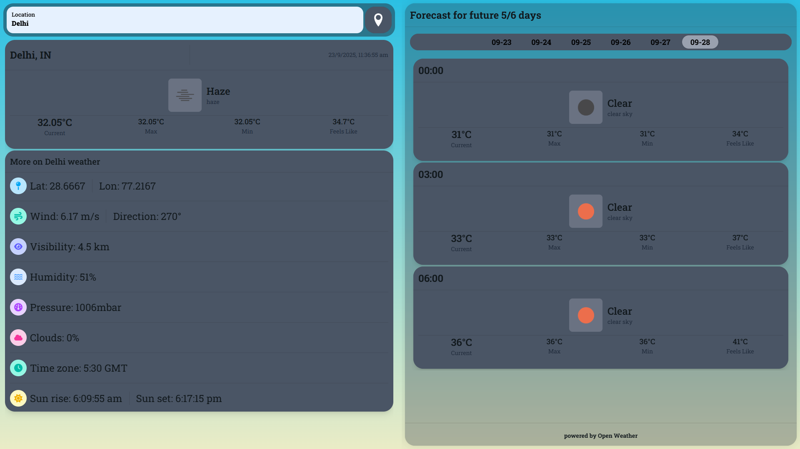

# React weather app
## preview
 

## libraries used

| Icon | Technology | Category |
|------|------------|----------|
|  | [Vite](https://vite.dev/) | **Build tool** |
|  | [React](https://react.dev/) | **UI building** |
|  | [Tailwind CSS](https://tailwindcss.com/) | **CSS frameWork** |
|  | [Daisy-ui](https://daisyui.com/brand/) | **Component library** |
|  | [Axios](https://axios-http.com/) | **API request** |
|  | [tanstack/react-query](https://tanstack.com/query/latest) | **Caching and data management** |

